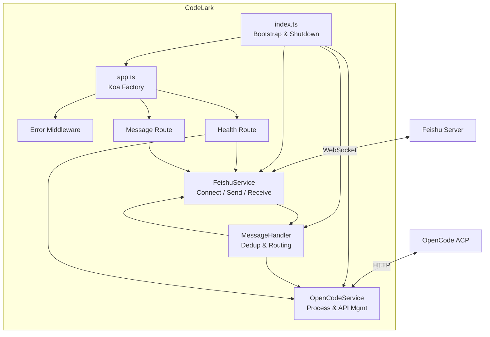
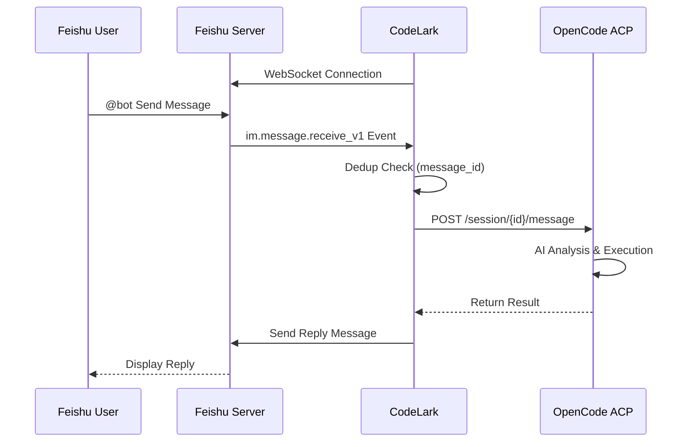

# 🤖 CodeLark

Connect [OpenCode](https://github.com/opencode-ai/opencode) AI coding assistant to [Feishu (Lark)](https://www.feishu.cn/) group chats — chat with AI, read and analyze code, all within your team's Feishu workspace.

## ✨ Features

- 📨 **Feishu WebSocket** — Real-time message receiving via persistent connection, no public domain required
- 🤖 **OpenCode Integration** — Auto-start and manage the OpenCode ACP process with graceful shutdown
- 💬 **Natural Conversation** — @mention the bot in Feishu groups to chat with the AI coding assistant
- 📂 **Code Analysis** — Read, search, and analyze local code repositories
- 🔄 **Auto Recovery** — Automatic restart when the OpenCode process exits unexpectedly
- 🛡️ **Production Ready** — Structured logging, config validation, error handling, message deduplication

## 🏗️ Architecture





## 📦 Prerequisites

- **Node.js** >= 18
- **OpenCode** installed ([Installation Guide](https://github.com/opencode-ai/opencode#installation))
- **Feishu Developer Account** with a self-built app ([Guide](https://open.feishu.cn/document/develop-process/self-built-application-development-process))

## 🚀 Quick Start

### 1. Clone the Repository

```bash
git clone https://github.com/your-username/codelark.git
cd codelark
```

### 2. Install Dependencies

```bash
npm install
```

### 3. Configure Environment Variables

```bash
cp .env.example .env
```

Edit the `.env` file with your Feishu app credentials:

```env
FEISHU_APP_ID=your_app_id_here
FEISHU_APP_SECRET=your_app_secret_here
```

### 4. Configure Feishu App

In the [Feishu Developer Console](https://open.feishu.cn/app):

1. Create a self-built app, obtain the App ID and App Secret
2. Add **Bot** capability
3. Go to **Events & Callbacks** → Subscription Mode → Select **Receive via Persistent Connection**
4. Subscribe to event `im.message.receive_v1` (receive messages)
5. Under **Permissions**, add:
   - `im:message` — Read and send messages in chats
   - `im:message:send_as_bot` — Send messages as the bot
6. Publish the app version

### 5. Start

```bash
# Development mode (hot-reload with pretty logs)
npm run dev

# Production mode
npm start
```

You should see output similar to:

```
INFO [main]: CodeLark server started {"port":3000}
INFO [feishu]: Feishu WebSocket connection started
INFO [opencode]: OpenCode ACP process started {"pid":12345}
INFO [opencode]: OpenCode service is ready
INFO [opencode]: OpenCode session created {"sessionId":"ses_xxxxx"}
```

## ⚙️ Configuration

| Variable                   | Required | Default       | Description                                   |
| -------------------------- | -------- | ------------- | --------------------------------------------- |
| `FEISHU_APP_ID`            | ✅       | -             | Feishu App ID                                 |
| `FEISHU_APP_SECRET`        | ✅       | -             | Feishu App Secret                             |
| `PORT`                     | ❌       | `3000`        | Koa HTTP server port                          |
| `OPENCODE_PATH`            | ❌       | `opencode`    | Path to the OpenCode executable               |
| `OPENCODE_PORT`            | ❌       | `4096`        | OpenCode ACP server port                      |
| `OPENCODE_CWD`             | ❌       | `./output`    | OpenCode working directory                    |
| `OPENCODE_STARTUP_TIMEOUT` | ❌       | `30000`       | Startup timeout in ms                         |
| `LOG_LEVEL`                | ❌       | `info`        | Log level (fatal/error/warn/info/debug/trace) |
| `NODE_ENV`                 | ❌       | `development` | Environment (development/production)          |

## 📁 Project Structure

```
codelark/
├── src/
│   ├── index.ts                 # Entry point — bootstrap & graceful shutdown
│   ├── app.ts                   # Koa app factory (middleware, routes)
│   ├── config.ts                # Configuration with validation
│   ├── logger.ts                # Structured logger (pino)
│   ├── services/
│   │   ├── feishu.ts            # Feishu client (connect, send, receive)
│   │   └── opencode.ts          # OpenCode process & API management
│   ├── handlers/
│   │   └── message.ts           # Message processing (dedup + routing)
│   ├── routes/
│   │   ├── health.ts            # Health check endpoint
│   │   └── message.ts           # REST API for sending messages
│   └── middleware/
│       └── error.ts             # Global error handling
├── tsconfig.json
├── .env.example
├── package.json
└── README.md
```

## 🔌 HTTP API

### Health Check

```bash
GET /health
```

Returns the status of all services:

```json
{
  "status": "ok",
  "timestamp": "2026-03-06T10:00:00.000Z",
  "services": {
    "feishu": { "connected": true },
    "opencode": { "running": true, "pid": 12345, "sessionId": "ses_xxx" }
  }
}
```

### Send Message

```bash
POST /api/message/send
Content-Type: application/json

{
  "chatId": "oc_xxxxx",
  "content": "Hello from API!"
}
```

## 🤝 Contributing

Issues and Pull Requests are welcome!

## 📄 License

[MIT](LICENSE)
